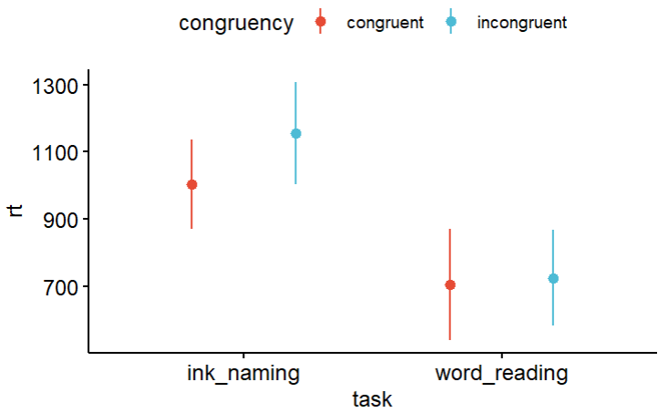

# Stroop Analysis Project 
## General Description
This is a Stroop analysis project conducted as part of a 2024/5 R course.
In this project we arranged a filtered version of stroop experiment data, presented descriptive statistics and performed a linear regression.
The purpose of the analysis was to examine the effects of task (ink naming / word reading) and congruency between the named color and the ink color on reaction times. 

## Data Arrangement
In the file week_8_part_1.R is a code I used to assemble the collected data from the stroop experiment into a raw data file, and then filtered it to better match the planned analysis. 
The filtered rdata file includes the following columns: 
- subject
- task (ink naming / word reding).
- congruencey (congruent / incongruent).
- block
- trial 
- accuracy
- rt: reaction time in milliseconds.   

## Descriptive Statistics
In the file week_8_part_2.R is a code I used to present descriptive statistics and plot the results.

An error plot illustrating the means and SDs of the reaction time variable in the task and congruency conditions

## Analysis
In the file week_8_part_3.R is a code I used to conduct a linear regression, in order to examine the effects of task type and congruency on reaction times in a stroop task.
